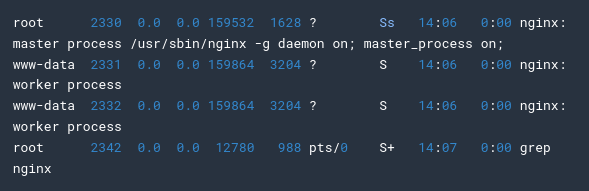

<h1>Google Cloud Platform - Notes</h1>

## Creating NGINX Server

Following commands are useful for installing nginx server on a virtual machine  
`apt-get install nginx -y`

Check the installation  
`ps auwx |grep nginx`

Output should be like below:

##### NGINX Server is installed and should be running!

## Create a Virtual Machine Instance with GCloud CLI

To create a VM Instance, run:  
`gcloud compute instances create --machine-type [machine-type] --zone [zone]`

e.g: `gcloud compute instances create gcelab2 --machine-type n1-standard-2 --zone us-central1-c`  
Virtaul Machine should be up and running!

#### Set Default Zone and Machine Type

`gcloud config set compute/zone ...`

`gcloud config set compute/region ...`

After this, you don't need to use `--zone` flag every time

## SSH a Virtual Machine

To connect with a VM through SSH, use:  
`gcloud compute ssh [name-of-vm] --zone [--zone-of-vm]`

e.g: `gcloud compute ssh gcelab2 --zone us-central1-c`
